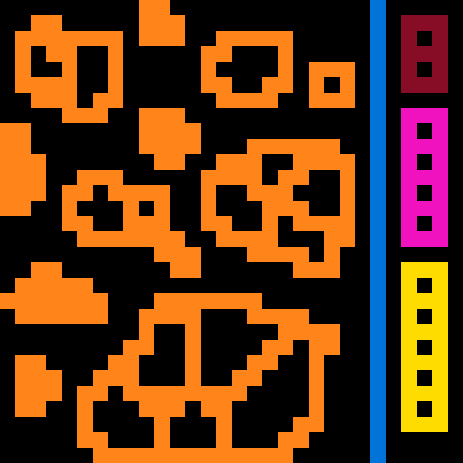
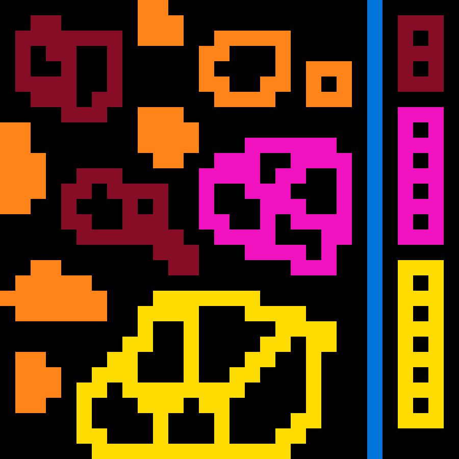
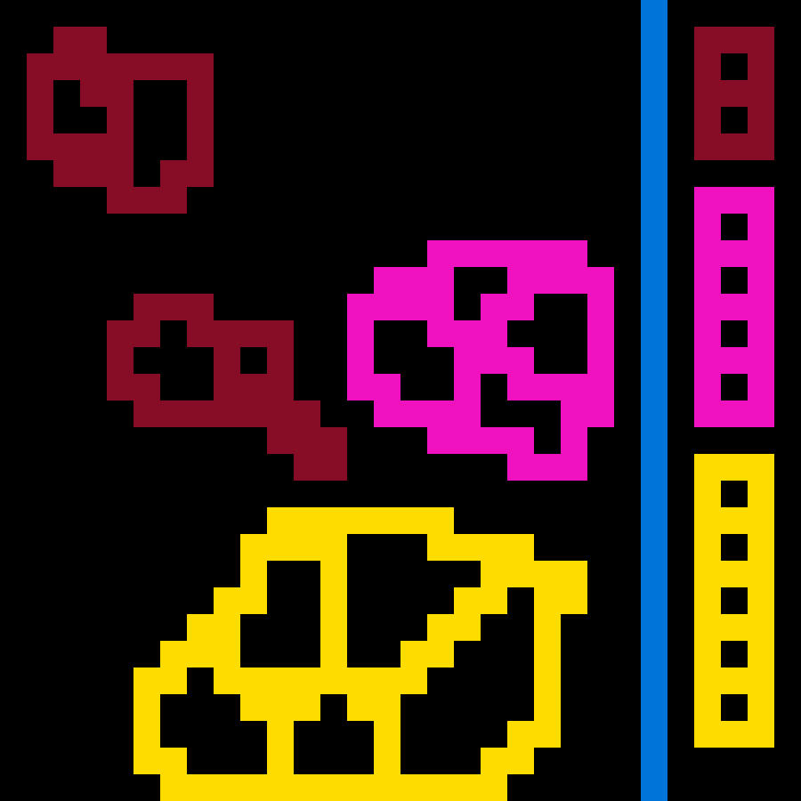
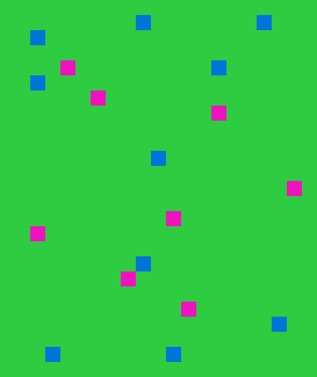
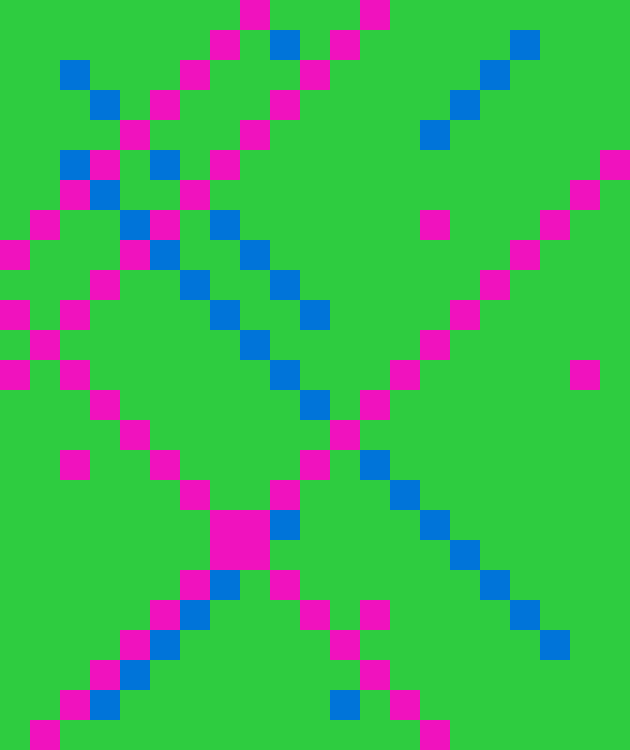
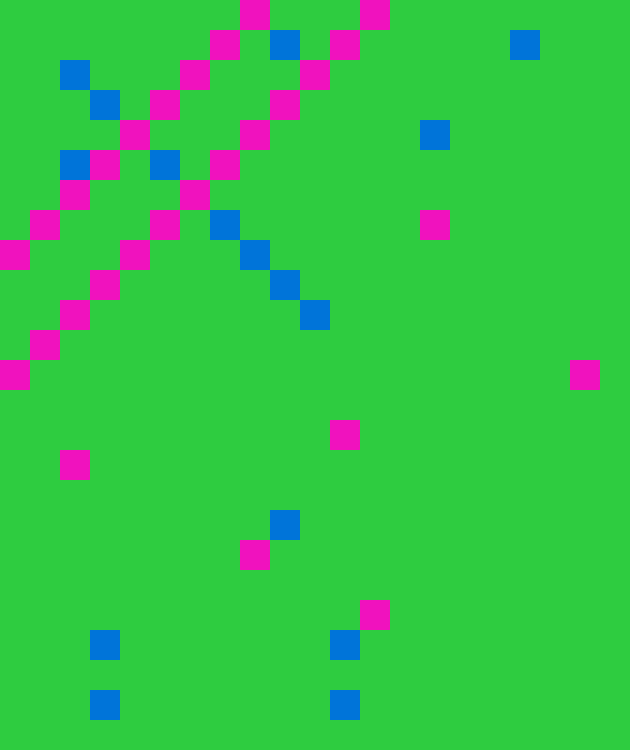
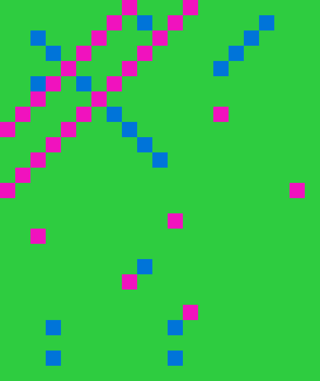
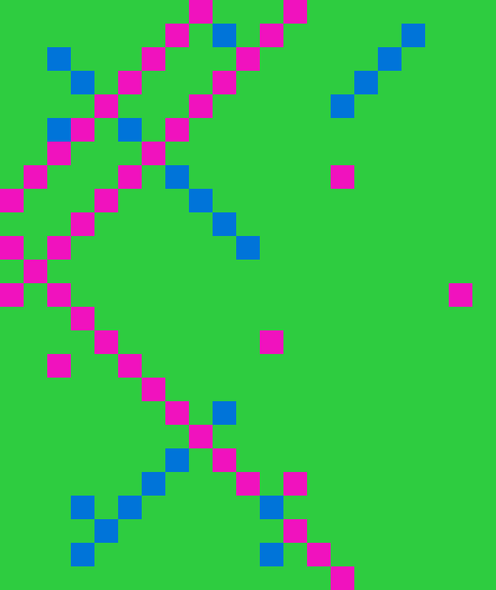

[ARC-AGI-2 reference](https://arcprize.org/arc-agi/2/).

I built a Python solver with Claude 🤖 over the weekend to test an idea I had—could treating ARC-AGI-2 puzzles as visual pattern recognition tasks rather than symbolic manipulation problems actually work? The arc_visual_solver employs a phased visual approach by converting numerical grids into PNG images and leveraging GPT-5's multimodal capabilities. The solver progressively feeds training examples through distinct phases: first showing an input-output pair as color-coded images using a fixed palette mapping 0-9 to specific colors, then presenting subsequent training inputs and asking the model to predict outputs before revealing the actual answers. Throughout this process, the solver maintains conversation history and emphasizes key principles in its prompts—that transformations are deterministic and reproducible, that symbols may have semantic significance through their visual properties, and that compositional reasoning with turn-by-turn rule application may be necessary.

The technical implementation uses GPT-5-thinking model, configured with high reasoning effort and function calling capabilities. The solver provides a visualization tool that the model can invoke to generate intermediate grid representations during its reasoning process, allowing for iterative refinement of hypotheses. In successful runs, GPT-5 utilized the tool more than usual, getting a visual representation of a few different approaches. This approach aligns with François Chollet's emphasis on the importance of visual reasoning and compositional generalization—rather than relying purely on pattern memorization, the visual format may help the model identify transformation rules that are more apparent through visual inspection than numerical analysis, potentially engaging different reasoning pathways that are less dependent on training data contamination.

I achieved a 22% score on ARC-AGI-2's evaluation dataset in initial testing of 40 sample problems, which needs more investigation but represents a significant improvement over the current AI state-of-the-art of 15.9%. Each problem cost roughly $0.90 in tokens to solve. The visual approach may be tapping into the importance of perceptual grounding in abstract reasoning—by presenting puzzles as images rather than symbolic representations, the model might be engaging different cognitive pathways that are less dependent on memorized patterns and more focused on genuine visual pattern recognition. The fact that extensive exploration is needed suggests the model is doing sophisticated pattern matching, but the visual format may help distinguish between superficial statistical correlations and meaningful geometric transformations. Testing on guaranteed unseen data is needed for legitimate validation. Even if the 22% score still reflects some degree of training data influence (or more likely isn't born out in further testing to such a degree), the methodology demonstrates that visual reasoning approaches can substantially improve AI performance on abstract reasoning tasks—notably, naive prompting without visuals failed on problems where the visual solver succeeded, suggesting the visual format itself may be key to accessing latent reasoning capabilities.

The detailed analysis of GPT-5's problem-solving patterns reveals genuinely sophisticated behavior that goes beyond simple pattern matching. The model demonstrates systematic hypothesis formation, developing explicit testable rules after examining each training example, and shows progressive refinement when predictions fail—genuinely revising its understanding rather than making superficial adjustments. Perhaps most remarkably, GPT-5 actively uses the visualization tool to test hypotheses, showing exploratory behavior, and frequently assigns meaningful semantic labels to patterns like "onion layers," "rooms and corridors," or "anchor points," suggesting it's building abstract representations rather than just processing pixels. The model consistently acknowledges ambiguity explicitly, emphasizes finding rules that work across ALL examples (showing understanding of determinism requirements), and demonstrates self-correction capabilities by identifying specific aspects of failed rules rather than starting over.

Success patterns emerge from breaking problems into sub-components, invariant detection, and multi-level pattern recognition, while failures typically involve over-specification, ambiguous ordering rules, and edge case handling. The visual approach appears to activate different reasoning pathways through Gestalt principles, direct spatial reasoning engagement, and immediate pattern salience that makes visual patterns like hollow squares or connected regions apparent without requiring coordinate arithmetic. While the 22% success rate (on limited testing) shows both potential and limitations, the systematic exploration and genuine problem-solving behavior observed suggests that visual presentation may indeed unlock spatial reasoning capabilities that purely symbolic approaches fundamentally miss.


### Setup and running

1. Clone repo
2. `export OPENAI_API_KEY=...`
3. `python3 arc_visual_solver.py ARC-AGI-2/data/training/00576224.json`
4. Or `python3 run_batch.py 10 -e -v -p 5` (runs 10 random problems from the evaluation set across 5 workers using the visual solver)
4. Use help menu to see other options (what dataset to run, run in parallel, etc.)
5. There are a few little helper python scripts for visualization

### Examples

Example: when comparing failed problems to GPT-5 prompting without visuals it becomes clear that the visual solver got much further than a naive implementation would have

| GPT-5 (Naive) | Visual Solver | Second Attempt | Correct |
|:-------------:|:-------------:|:-------------:|:-------------:|
|  |  |  |  |
|  |  | |  |

Example: iterating with tools to improve strategy and comparing results to output 

| Input | Output | Tool invocation 1 | Tool invocation 2 | Tool invocation 3 | Tool invocation 4 or First Attempt | Second Attempt |
|:-------------:|:-------------:|:-------------:|:-------------:|:-------------:|:-------------:|:-------------:|
|  |  |  |  |  |  | |
|  |  |  |  |  |  |  |

### Results 

```
================================================================================
BATCH RESULTS SUMMARY
================================================================================
Total tasks: 36
Successful: 8 (22.2%)
Failed: 28 (77.8%)
Error: 4 (OpenAI account ran out of money)
Total time: 80322.37s
Total phases: 177

Detailed Results:
Task                 Result     Time (s)   Phases    
--------------------------------------------------
dbff022c             ❌ FAIL     544.96     5         
1818057f             ✅ PASS     801.99     5         
7b80bb43             ❌ FAIL     1590.87    4         
cb2d8a2c             ❌ FAIL     2067.03    6         
5545f144             ❌ FAIL     2165.85    5         
fc7cae8d             ❌ FAIL     1940.38    5         
9bbf930d             ❌ FAIL     2328.38    5         
b0039139             ✅ PASS     1579.21    6         
a251c730             ❌ FAIL     1252.88    4         
2ba387bc             ✅ PASS     493.28     6         
36a08778             ❌ FAIL     1466.08    8         
16de56c4             ❌ FAIL     1029.02    5         
142ca369             ❌ FAIL     2496.15    5         
dd6b8c4b             ❌ FAIL     1936.63    5         
62593bfd             ❌ FAIL     2739.46    4         
faa9f03d             ❌ FAIL     3414.99    6         
7c66cb00             ✅ PASS     1118.54    5         
da515329             ⚠️ ERROR   3366.86    0         
4e34c42c             ⚠️ ERROR   2918.70    0         
7b5033c1             ✅ PASS     592.80     4         
e8686506             ❌ FAIL     1523.83    4         
88e364bc             ❌ FAIL     1163.52    5         
bf45cf4b             ✅ PASS     809.64     5         
38007db0             ✅ PASS     651.30     4         
16b78196             ❌ FAIL     1423.53    4         
291dc1e1             ❌ FAIL     2085.56    6         
4c7dc4dd             ❌ FAIL     1204.58    4         
88bcf3b4             ❌ FAIL     2166.80    7         
cbebaa4b             ❌ FAIL     4236.07    4         
7b0280bc             ❌ FAIL     1801.14    5         
135a2760             ❌ FAIL     1247.79    4         
136b0064             ✅ PASS     1548.96    5         
581f7754             ❌ FAIL     3606.33    5         
3a25b0d8             ❌ FAIL     1195.32    4         
b9e38dc0             ❌ FAIL     3648.41    5         
20a9e565             ❌ FAIL     2228.91    5         
7b3084d4             ⚠️ ERROR   2116.13    0         
de809cff             ❌ FAIL     4744.59    4         
8e5c0c38             ❌ FAIL     3137.17    4         
abc82100             ⚠️ ERROR   3938.73    0       

```

```
================================================================================
BATCH RESULTS SUMMARY (train)
================================================================================
Total tasks: 10
Successful: 7 (70.0%)
Failed: 3 (30.0%)
Total time: 7365.48s
Total phases: 51

Detailed Results:
Task                 Result     Time (s)   Phases    
--------------------------------------------------
bc1d5164             ✅ PASS     159.16     7         
ef135b50             ✅ PASS     314.61     5         
e69241bd             ✅ PASS     539.89     5         
762cd429             ✅ PASS     406.74     5         
1b60fb0c             ❌ FAIL     829.07     5         
b71a7747             ❌ FAIL     906.58     4         
292dd178             ✅ PASS     519.27     5         
bf699163             ✅ PASS     752.55     4         
18419cfa             ❌ FAIL     835.69     5         
09629e4f             ✅ PASS     2101.93    6     
```

Previous run:
```
================================================================================
BATCH RESULTS SUMMARY (eval)
================================================================================
Total tasks: 10
Successful: 4 (40.0%)
Failed: 6 (60.0%)
Total time: 9840.03s
Total phases: 51
Detailed Results:
Task Result Time (s) Phases
--------------------------------------------------
2ba387bc ✅ PASS 337.62 6
3e6067c3 ✅ PASS 905.73 5
dfadab01 ❌ FAIL 1064.52 6
2d0172a1 ❌ FAIL 1207.07 6
6e4f6532 ❌ FAIL 1387.00 4
1ae2feb7 ✅ PASS 477.20 5
de809cff ❌ FAIL 1236.57 4
fc7cae8d ❌ FAIL 1189.15 5
58490d8a ✅ PASS 777.47 5
89565ca0 ❌ FAIL 1257.71 5
```

**Reproducability** (duplicates across tests):

No mismatches between failed/successful runs.

```
1. 2ba387bc (appears 2 times)

Instance 1: ✅ PASS - 337.62s - 6 phases
Instance 2: ✅ PASS - 493.28s - 6 phases
Both passed but with different execution times

2. de809cff (appears 2 times)

Instance 1: ❌ FAIL - 1,236.57s - 4 phases
Instance 2: ❌ FAIL - 4,744.59s - 4 phases
Both failed, second run took much longer

3. fc7cae8d (appears 2 times)

Instance 1: ❌ FAIL - 1,189.15s - 5 phases
Instance 2: ❌ FAIL - 1,940.38s - 5 phases
Both failed with different execution times
```

**Baseline** naive prompting (no tools or visuals):
```
================================================================================
BATCH RESULTS SUMMARY (naive prompting)
================================================================================
Total tasks: 11
Successful: 6 (50%)
Failed: 6 (50%)
Total time: 8821.06s
Total phases: 55

Detailed Results:
Task                 Result     Time (s)   Phases    
--------------------------------------------------
7b5033c1             ❌ FAIL     248.55     4         
1ae2feb7             ✅ PASS     362.27     5         
1818057f             ✅ PASS     492.73     5         
2ba387bc             ✅ PASS     303.47     6         
bf45cf4b             ✅ PASS     318.47     5         
b0039139             ✅ PASS     886.55     6         
38007db0             ✅ PASS     328.00     4         
58490d8a             ❌ FAIL     1048.49    5         
136b0064             ❌ FAIL     1767.34    5         
7c66cb00             ❌ FAIL     1638.20    5         
3e6067c3             ❌ FAIL     1426.99    5     
db695cfb             ❌ FAIL     1132.00    7 (added post-run)    
```

Statistically 90% confident that the true success rate of the full 120-test evaluation suite falls between 11.2% and 32.8%. 

Clear improvement over naive prompting with GPT5:
* GPT5 failed 50% of problems solved by the visual approach (of 12 successful problems, failed 6)
    * GPT5 is officially measured at 10% success rate; this puts it at 11% success rate (which seems close enough).
* Analysis of problems that failed show greater understanding and more correct outputs.


### Random

_This project desperately needs code cleanup and improved logging._

**Branches:**
* `claude-tool`: testing claude with heavy tool use. Results: totally unable to solve almost any problems, even when given specific instructions on how to find solution
* `more-tool-use-checkpoint-aug13`, `tool-use`: investigations for heavier tool use and better prompt iterating (fewer prompts with more thinking, more specific instructions, more tools, etc.)
* `naive-prompting`: baseline for gpt5 without visualization or tools.

### Thoughts and observations 

Future investigation:
* Solving multiple tests if they exist 
* Two attempts to solve
* Improved prompting (specific instructions, more structured flow)
* Natural language DSL generation (ask model to output functions like "find key", "paint boxes X color", etc.)

Interesting takeaways:
* More tools are not beneficial (visualization tool was beneficial but any other tools were not, likely overwhelmed the model) 
* Specific prompting phases help (most successful when gradually introducing new training sets with new prompts) 

Long form thoughts:

_coming soon..._